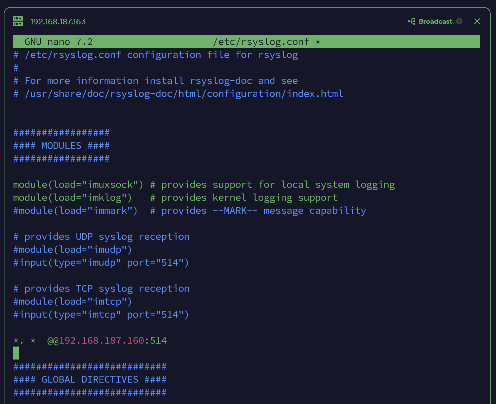
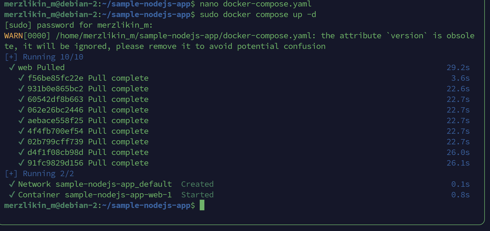

# Практическое задание №1. Сбор логов

Выполнил Мерзликин Максим, группа ББМО-01-23

## `rsyslog`

### Установка `rsyslog` на сервер

### Настройка модулей `rsyslog`

### Добавление правил обработки логов

### Установка `rsyslog` на клиент

### Добавление правила пересылки логов на сервер

### Просмотр полученных логов на сервере

## Grafana Loki

### Редактирование compose-файла с целью отключения компонента `promtail` на сервере

### Запуск Loki

### Редактирование конфигурации `promtail` на клиенте

### Просмотр логов клиента в Grafana

## Signoz

### Запуск Signoz

Установка согласно https://signoz.io/docs/install/docker/#install-signoz-using-docker-compose

### Рабочая панель Signoz

### Редактирование конфигурации клиентского приложения для отправки данных в Signoz

Используемое приложение - https://github.com/SigNoz/sample-nodejs-app/

### Запуск клиентского приложения

### Информация о приложении в Signoz

