# Практическая работа №3. Wazuh

Выполнил Мерзликин Максим, ББМО-01-23

## Подготовка стенда, создание виртуальных машин

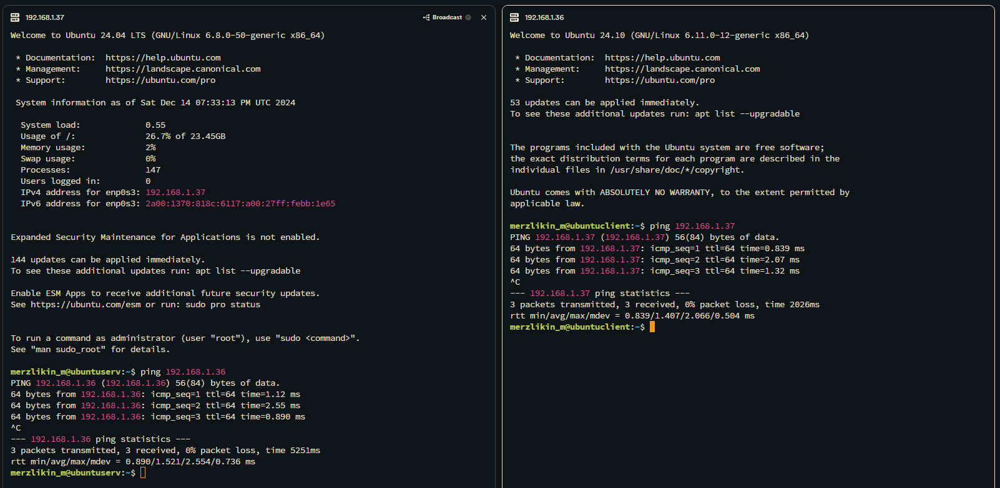

## Установка сервера Wazuh

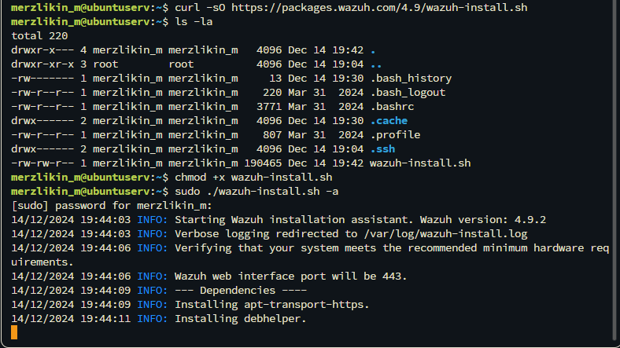

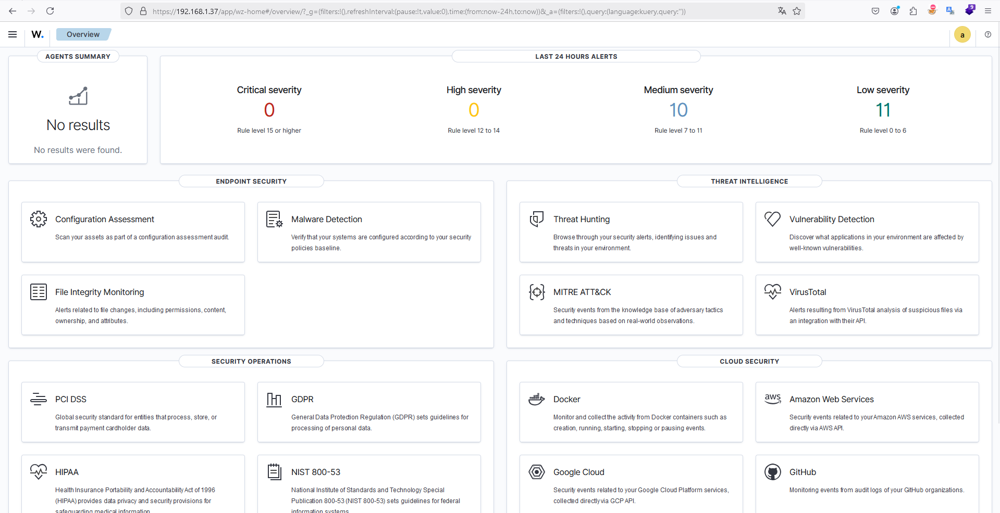

## Установка агента Wazuh

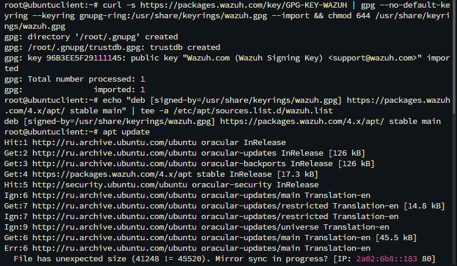

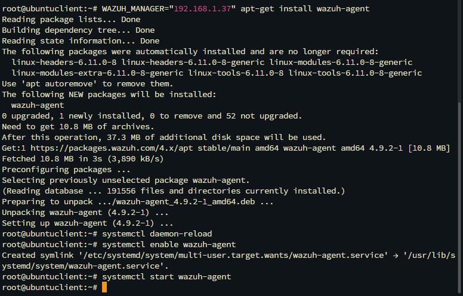

## Подключенный агент в дашборде

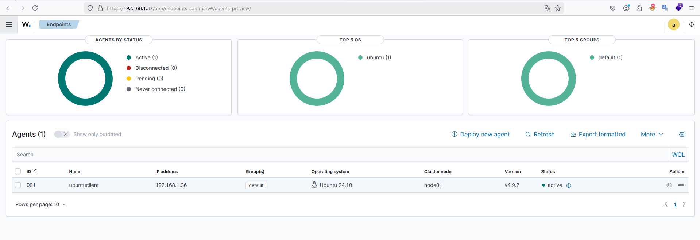

## Найденные уязвимости в конфигурации по умолчанию

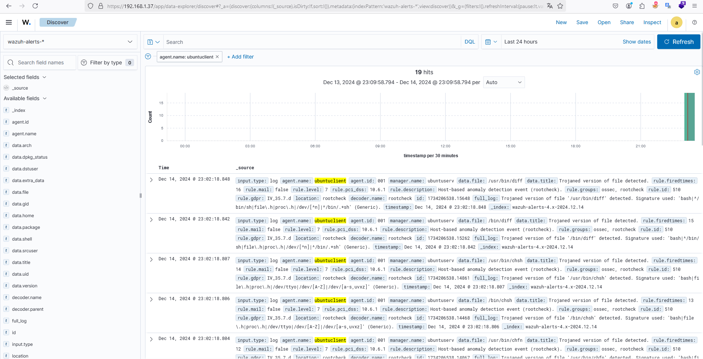

## Настройка проверки целостности файлов

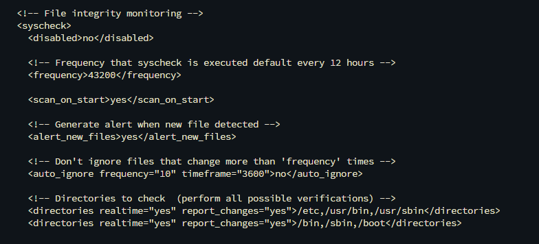

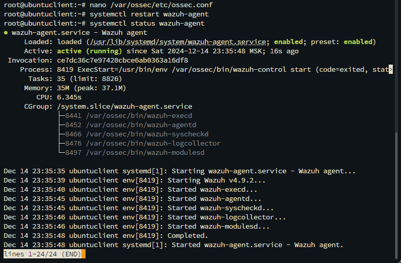

### Изменение конфигурационного файла `/etc/hosts`

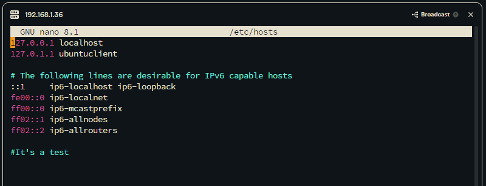

### Срабатывание правила

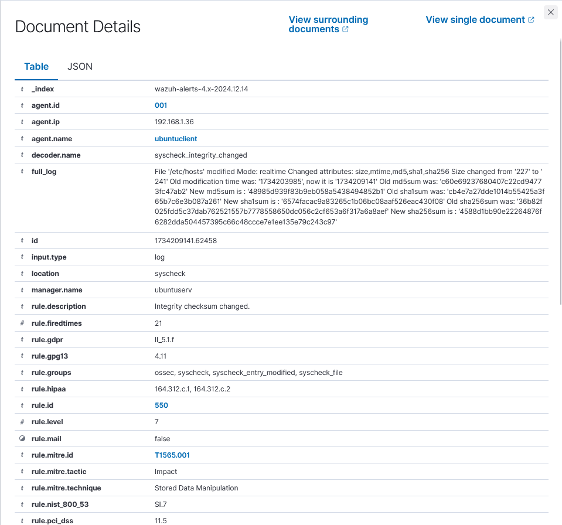

## Настройка проверки уязвимостей

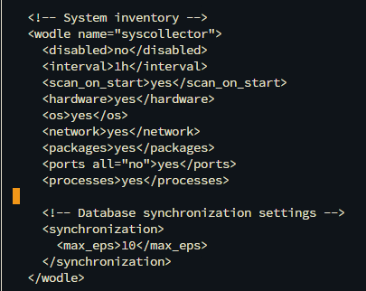

## Настройка выявления скрытых процессов

### Установка необходимых пакетов

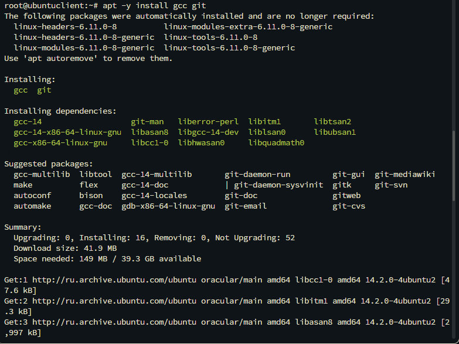

### Настройка мониторинга процессов в агенте Wazuh

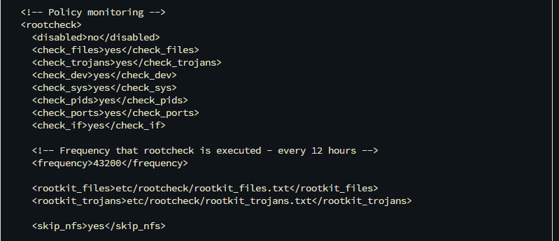

### Сборка и запуск руткита

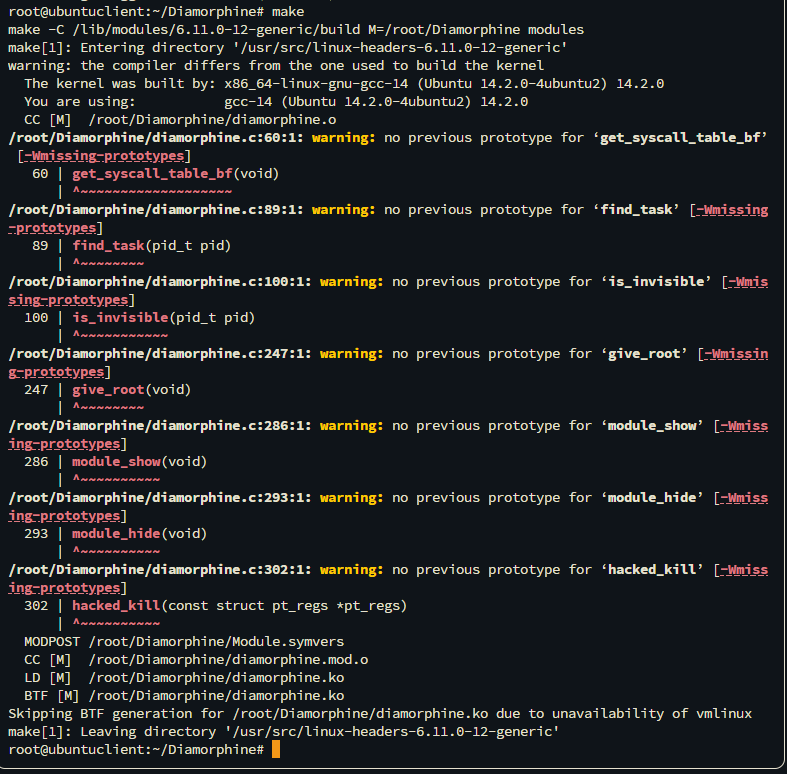

### На данном этапе произошла ошибка.
### К сожалению, данный пункт задания выполнить не удалось, так как не удавалось запустить нужное ПО для проверки правила.

## Настройка выявления SQL-инъекций

### Установка веб-сервера Apache

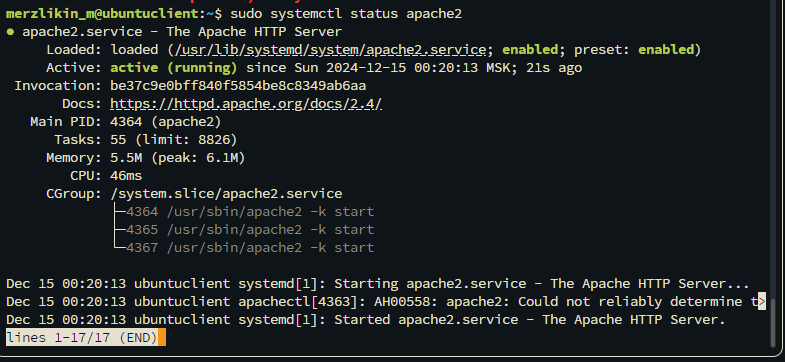

### Конфигурация мониторинга логов Apache

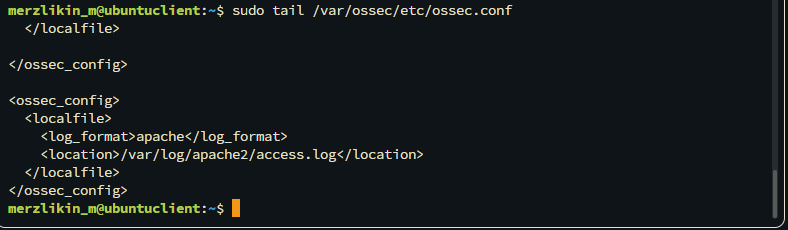

### Срабатывание правила

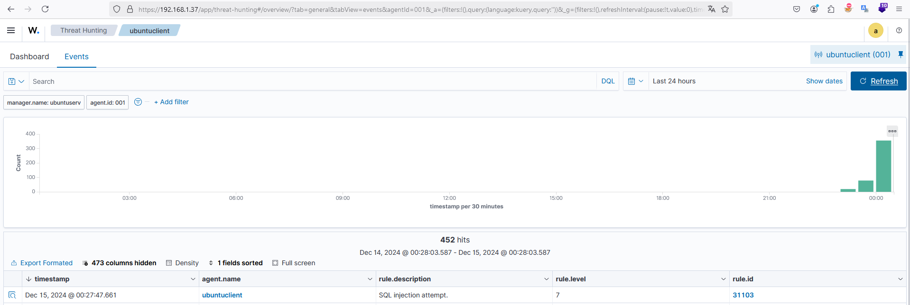

## Проверка выявления атаки Shellshock

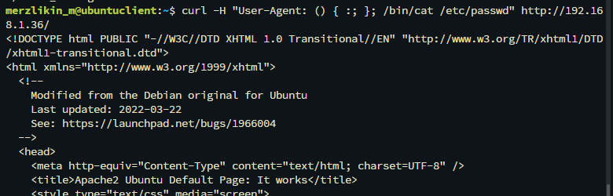

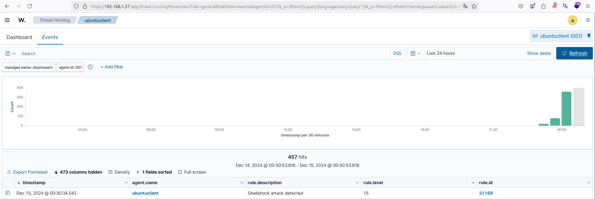
