# Практическая работа №4. Network Threat Hunting

Выполнил Мерзликин Максим, ББМО-01-23

## Развёрнутый стенд

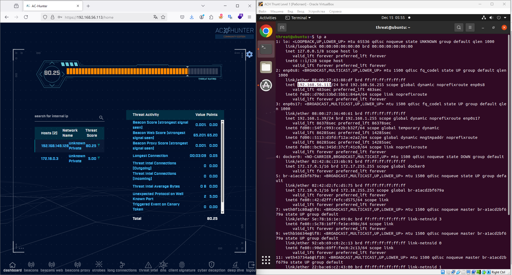

## Первое задание, импорт логов

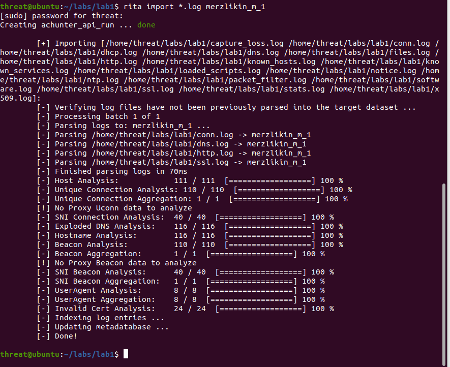

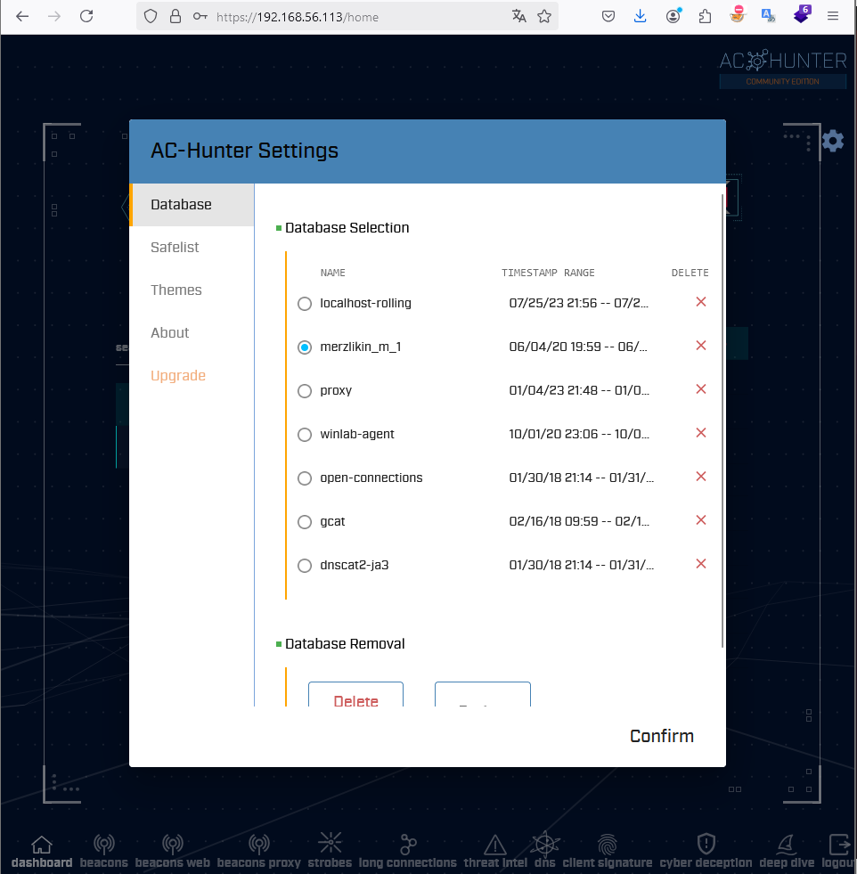

## Информация о подключениях

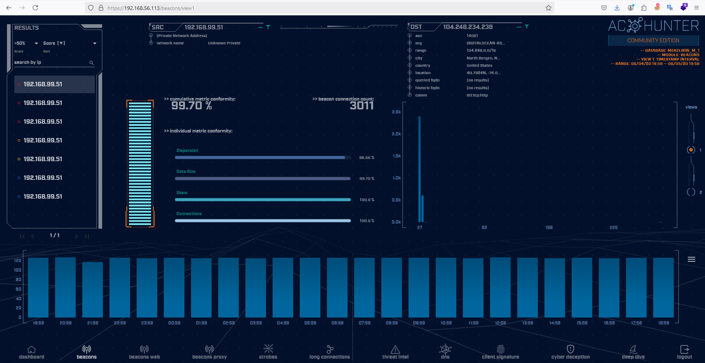

В ходе просмотра подключений, совершённых с хоста 192.168.99.51, установлено, что единственным подозрительным соединением является подключение к IP-адресу 104.248.234.238. Остальные соединения осущетсвляются к сервисам Microsoft, являющиеся легитимными, поэтому их можно добавить в Safelist.

### Добавление легитимных узлов в Safelist

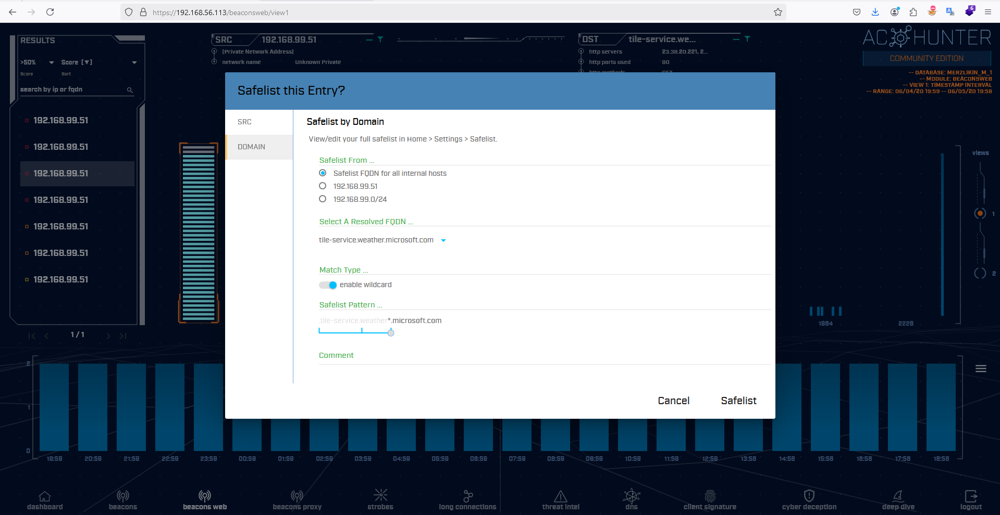

### Остается один нелегитимный адрес:

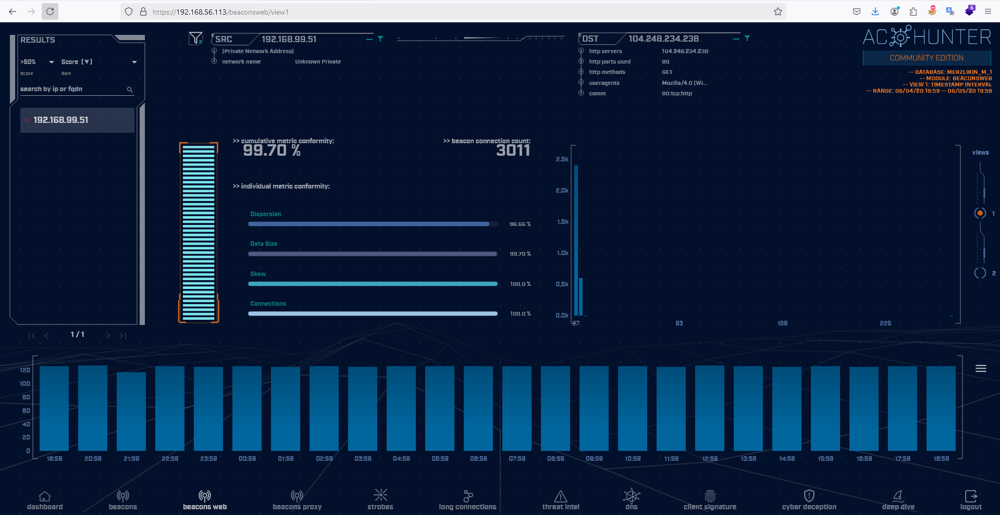

### Анализ HTTP-логов

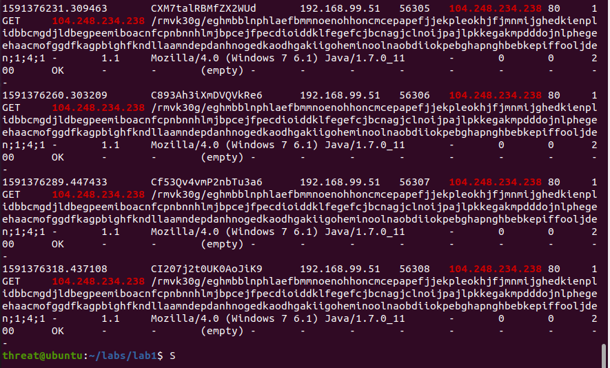

Все 3011 подключений, совершённых с подозрительного IP, являются HTTP-запросами по длинному обфусцированному URL. Также принимая во внимание, то, что:

- Подключение производится по IP-адресу, а не FQDN
- Заголовок User-Agent не похож на стандартные

можно сделать вывод, что это подключение использовалось для реализации C&C.

## Задание 2, импорт логов

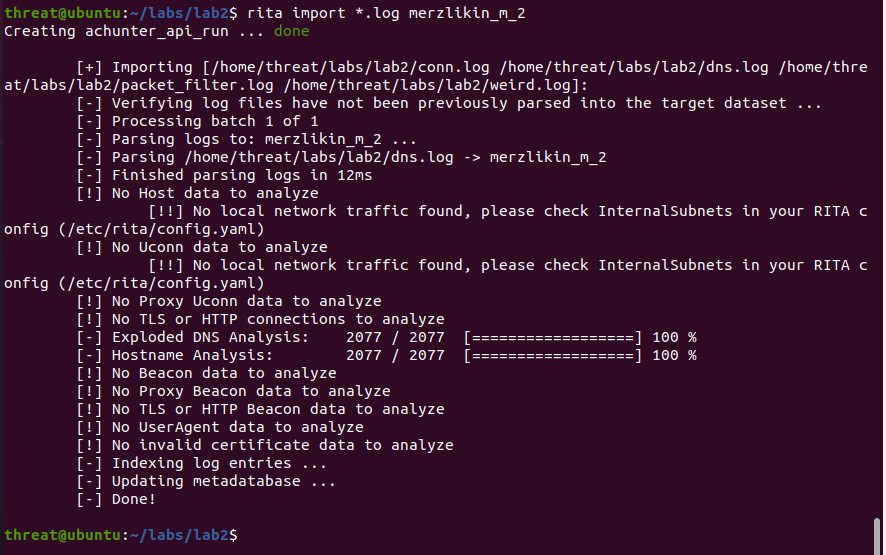

### Анализ DNS-запросов

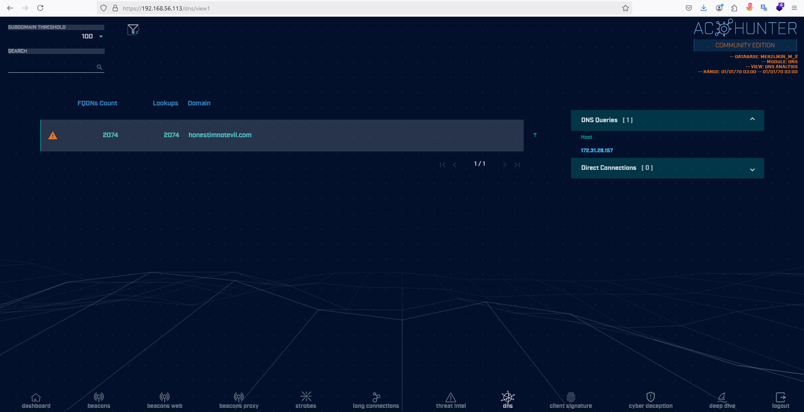

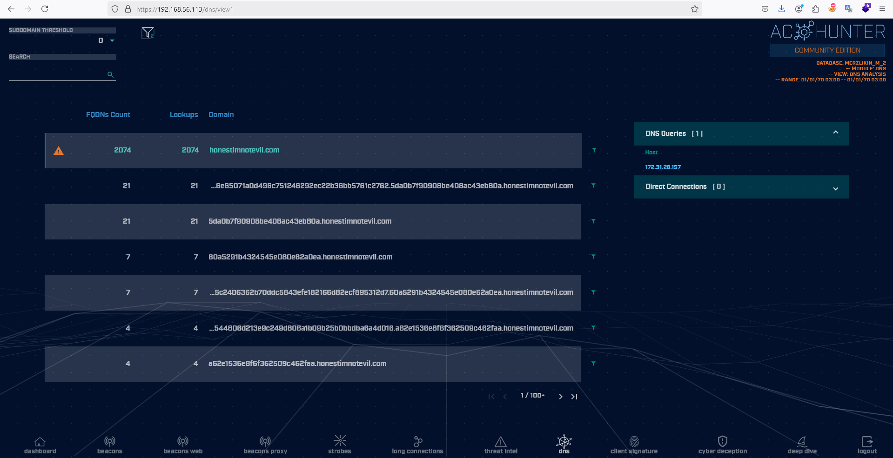

Можно увидеть большое количество DNS-запросов к домену `honestimnotevil.com`, в том числе поддоменам, состоящим из длинных hex-строк. Вероятно, эти подключения использовались для осуществления C2 через DNS.

## Задание 3, импорт логов

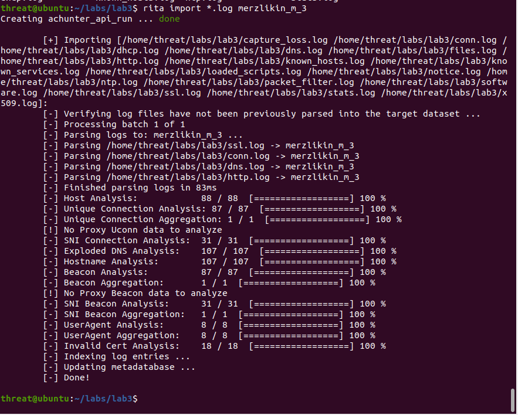

Можно увидеть подозрительное соединение с узлом `skypetm.com.tw`. Этот домен не относится к компании Microsoft, но пытается быть похожим на официальный ресурс, связанный с средством ВКС Skype. Вероятно он используется злоумышленниками, в чём можно убедиться, проанализировав URL в сервисе Virustotal.

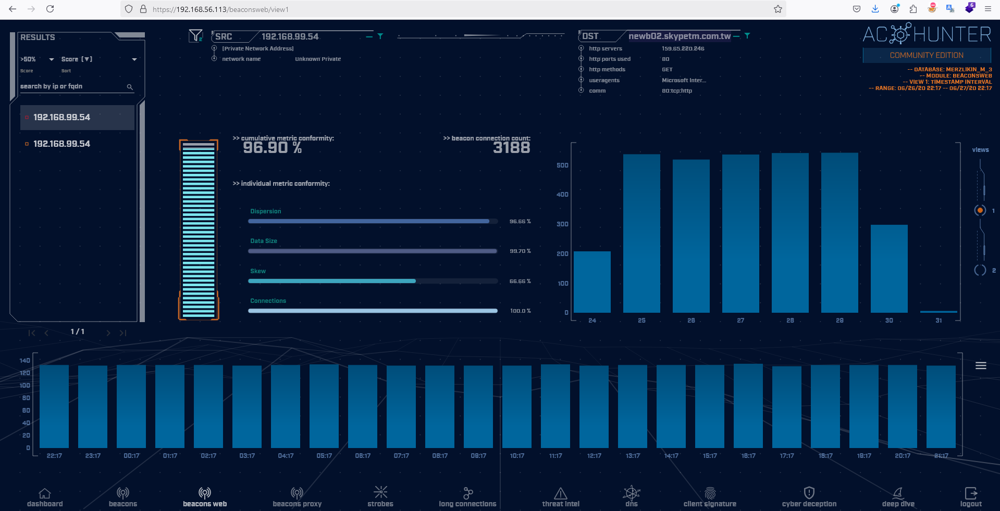

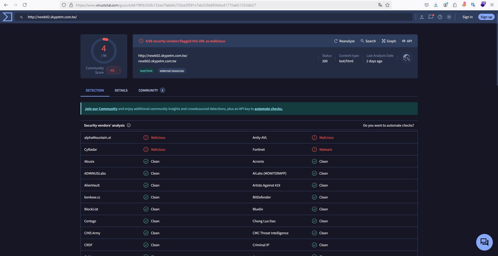
