# Практическая работа №5. Threat Hunting

Выполнил Мерзликин Максим, ББМО-01-23

Для работы были использованы уже ранее созданные в [ПРЗ №3](../prz_3/) стенды Wazuh.

## Установка и настройка IDS Suricata

Установка IDS Suricata:

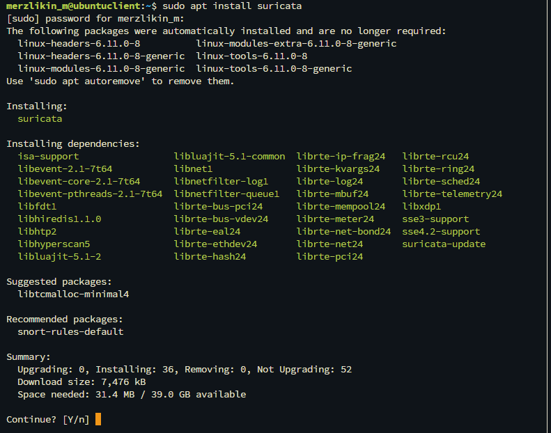

Загрузка правил обнаружения:

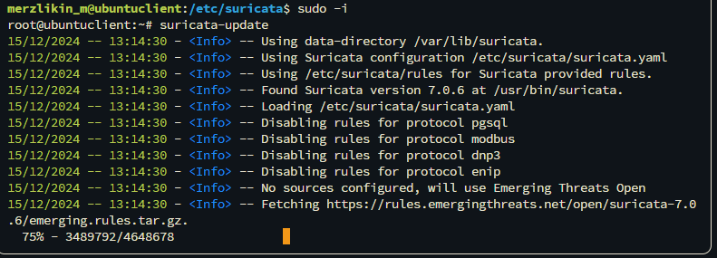

Настройка переменных конфигурации в файле `/etc/suricata/suricata.yaml`:

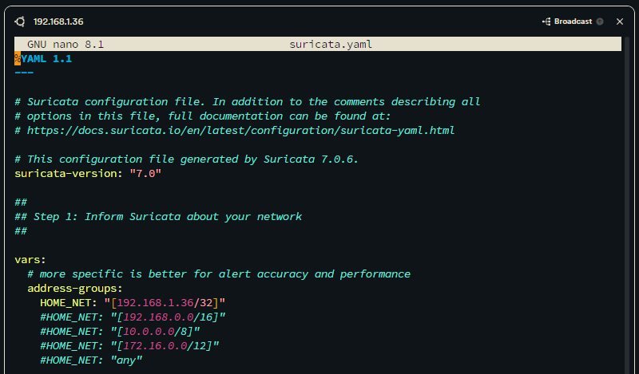

Настройка импорта логов Suricata в Wazuh и перезапуск агента:

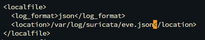

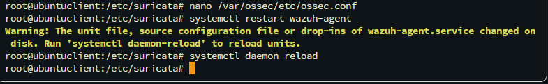

## Установка и настройка Yara

### Настройка агента

Загрузка и распаковка дистрибутива:

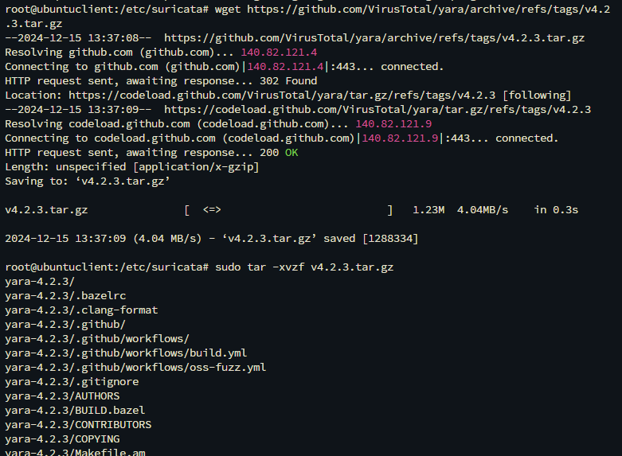

Установка Yara:

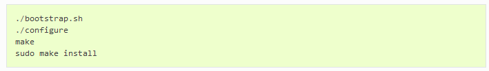

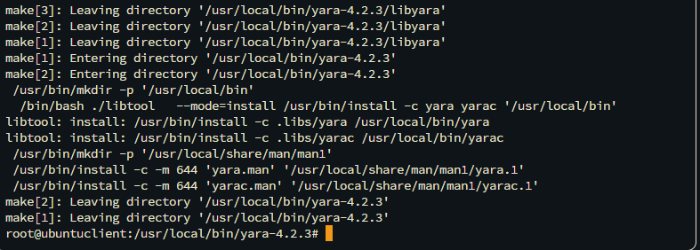

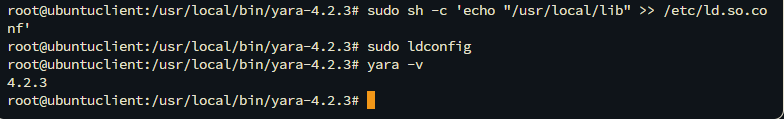

Загрузка YARA-правил:

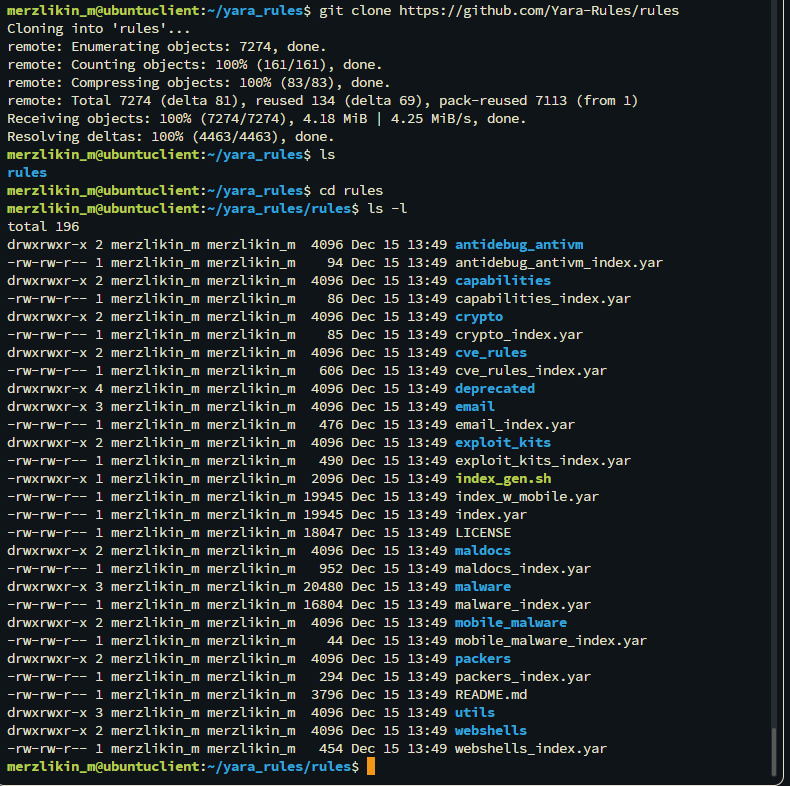

Создание скрипта `yara.sh` для Wazuh и установка корректных привилегий согласно документации:

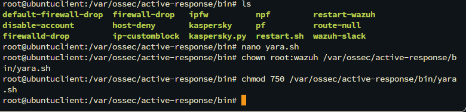

Настройка правил мониторинга в файле `/var/ossec/etc/ossec.conf`:

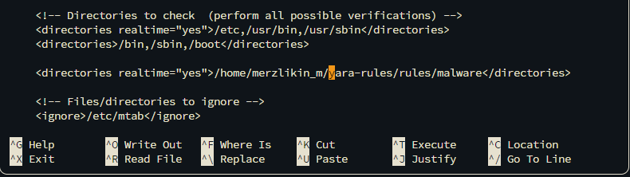

### Настройка сервера

Настройка правил Wazuh для отслеживания изменений и срабатывания правил YARA:

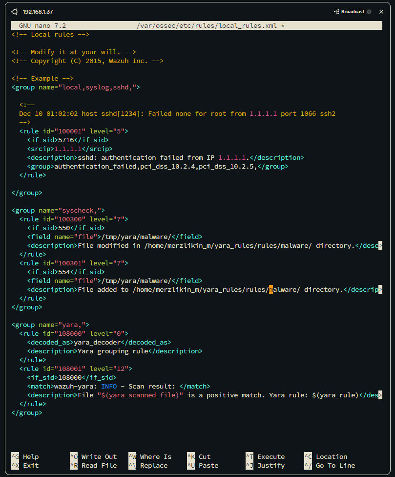

Настройка декодера результатов сканирования Yara:

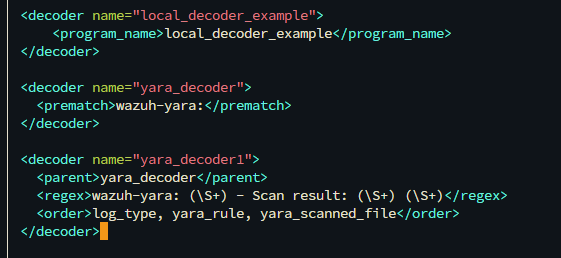

Настройка команд Wazuh, который будут запускать сканирование при обнаружении изменений в отслеживаемой директории:

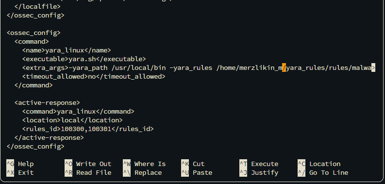

## Эмуляция атаки

Для осуществления атак в гипервизоре также была развёрнута виртуальная машина с Kali Linux:

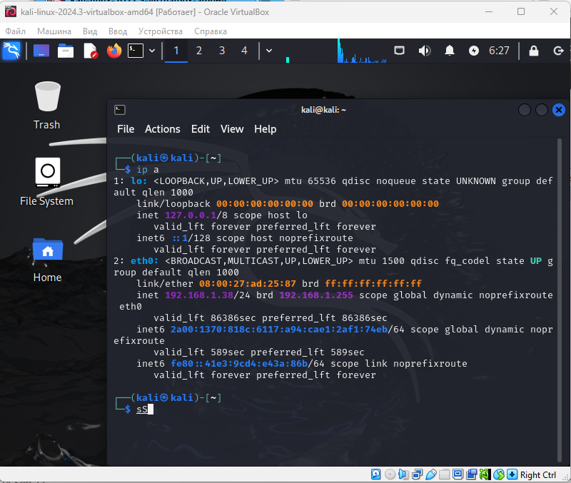

Для проверки работы IDS Suricata было запущено сканирование защищаемого узла сканером веб-уязвимостей `nuclei`:

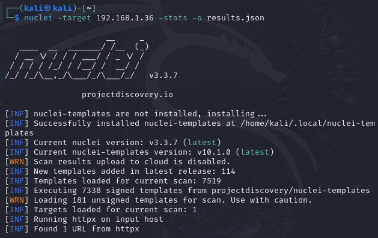

События, созданные IDS Suricata, выяглядят в логах следующим образом:

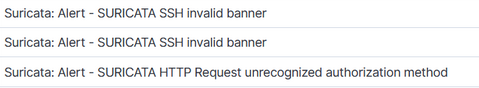

